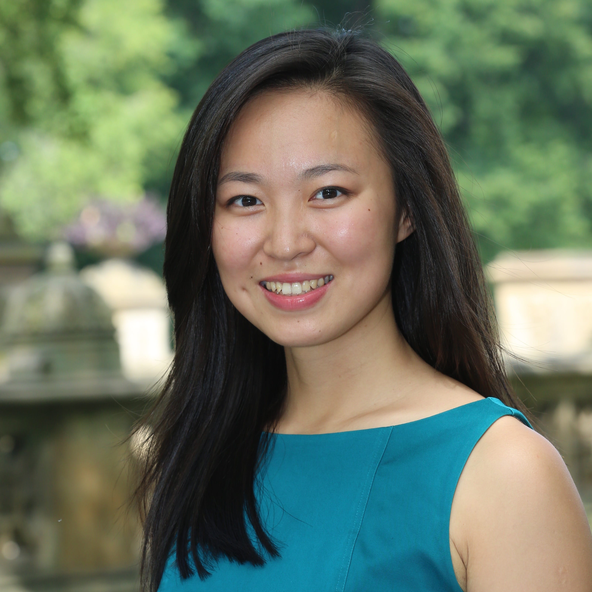

[About](index.md) • [Research](research.md) • [Teaching](teaching.md) • [CV](cv.md)

---

Welcome! I study how organizations---from established firms to small businesses---hire and retain talent, and the uneven effects of these organizational processes on women's and men's compensation, productivity, and career trajectories.

I am a Postdoctoral Fellow at the Tamer Institute for Social Enterprise and Climate Change at Columbia Business School. I am also a Research Affiliate at the Harvard Kennedy School. Previously, I was a Postdoctoral Fellow at Harvard Business School.

I hold a Ph.D. in Organizational Behavior from the Stanford Graduate School of Business, and an A.B. in English and an A.M. in Statistics from Harvard University. 

